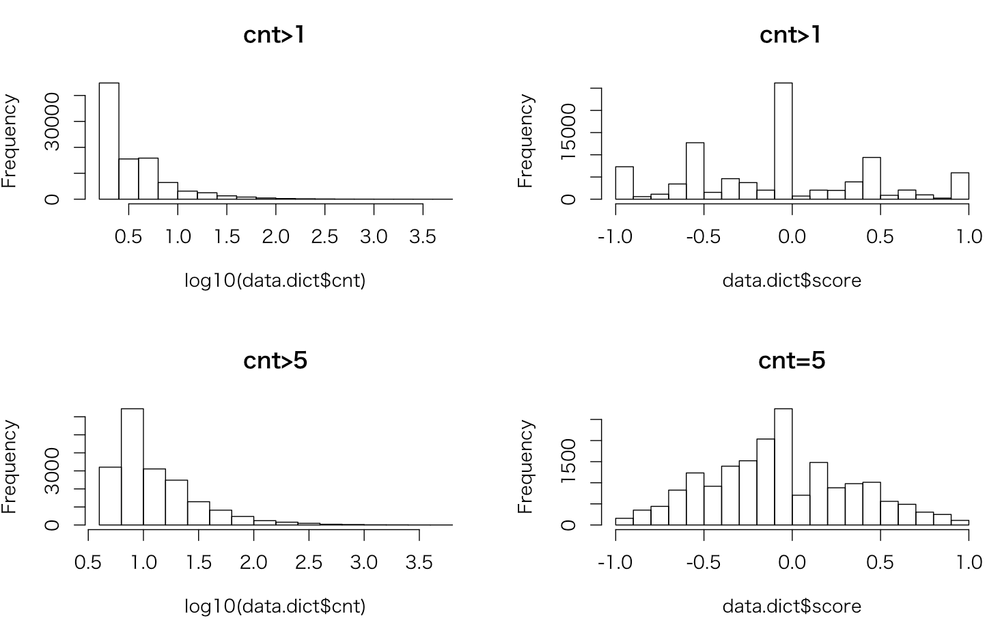

# 極性辞書

[YahooNews](news/md/DICT.md)と[景気ウオッチャー](keiki_watcher/md/DICT.md)をうまくマージして作成する   
景気ウオッチャーは現状判断と将来予測の両方を使う

## 辞書仕様
#### 極性値
景気ウオッチャーは良い、やや良いを＋１、悪い、やや悪いを−１、その他を０とする    
ニュースは対TOPIX株価騰落率が＋５％以上で＋１、−５％以下で−１、その他を０とする   　　
ニュースの騰落率計算は、ニュース配信時刻が15:00以降の場合には直前の終値と明日の終値から求める。15:00より前は、前日終値と当日終値の騰落率から求める

#### 構文解析
* mecab   
* [辞書](https://github.kabumap.tokyo/utsubo/dictionary)   
weblioとneologdを使用
```
$ cat .mecabrc
userdic = /home/ubuntu/dictionary/neologd/neologd.dic,/home/ubuntu/dictionary/weblio/weblio.dic
```

#### 形態素解析
* cabochaを使用   

#### データソース
|データソース|期間|
|:---|:---|
|景気ウオッチャー|201001-201512|
|Yahooニュース|20140101-20151231|
----
## 辞書作成
```
$ ruby all_dict.rb
$ sqlite3 dict.db < schema.sql
$ sqlite3 dict.db << Eof
.separator "\t"
.import all_dict.txt dict
Eof
```
----
## 辞書検証
#### CNTの足切りラインを決める
```
> library(RSQLite)
> con<-dbConnect(dbDriver("SQLite"),"dict.db")
> par(mfrow=c(2,2))
>
> res<-dbSendQuery(con,"select * from dict where cnt>1")
> data.dict<-fetch(res,-1)
> length(data.dict$cnt)
[1] 91389
> hist(log10(data.dict$cnt),main="cnt>1")
> hist(data.dict$score,main="cnt>1")
> summary(data.dict$cnt)
    Min.  1st Qu.   Median     Mean  3rd Qu.     Max.
   2.000    2.000    3.000    6.945    5.000 5606.000
>
```
3rd Qu.で切る

#### スコア
```
> res<-dbSendQuery(con,"select * from dict where cnt>5")
> data.dict<-fetch(res,-1)
> length(data.dict$cnt)
[1] 18401
> hist(log10(data.dict$cnt),main="cnt>5")
> hist(data.dict$score,main="cnt=5")
> summary(data.dict$cnt)
   Min. 1st Qu.  Median    Mean 3rd Qu.    Max.
   6.00    7.00   10.00   24.09   18.00 5606.00
```



#### 一覧

###### スコア上位 cnt>5

|score|cnt|word1|word2|word3|word4|word5|word6|word7|word8|word9|
|---:|---:|:---|:---|:---|:---|:---|:---|:---|:---|:---|
|1.0|35|見通し|良い||||||||
|1.0|24|先行き|見通し|明るい|||||||
|1.0|23|先行き|見通し|良い|||||||
|1.0|22|引き合い件数|増加する||||||||
|1.0|19|大変|好調だある||||||||
|1.0|19|良い|ため|良いなる|||||||
|1.0|18|多い|ため|良いなる|||||||
|1.0|18|景気|先行き|期待感|高まる||||||
|1.0|15|来客|成約件数|増加する|||||||
|1.0|15|経済対策|効果|出る|||||||

###### スコア上位 cnt>50

|score|cnt|word1|word2|word3|word4|word5|word6|word7|word8|word9|
|---:|---:|:---|:---|:---|:---|:---|:---|:---|:---|:---|
|0.932203389830508|59|見通し|明るい||||||||
|0.924528301886792|53|上向き傾向|なる||||||||
|0.865384615384616|52|客|動き|活発なる|||||||
|0.85595567867036|361|先行き|良いなる||||||||
|0.773584905660377|53|人|動き|活発なる|||||||
|0.770491803278688|61|消費税増税|駆け込み需要|見込む|||||||
|0.767857142857143|56|引き合い|増加する||||||||
|0.761904761904762|84|景気|良い||||||||
|0.761904761904762|63|月間有効求人|増加する||||||||
|0.757142857142857|70|景気|良いなるのだない||||||||

###### スコア下位 cnt>5

|score|cnt|word1|word2|word3|word4|word5|word6|word7|word8|word9|
|---:|---:|:---|:---|:---|:---|:---|:---|:---|:---|:---|
|-1.0|32|公共工事主体|行う||||||||
|-1.0|28|土木|舗装工事|行う|||||||
|-1.0|28|舗装工事|行う||||||||
|-1.0|17|少ない|ため|悪いなる|||||||
|-1.0|16|先|悪いなる||||||||
|-1.0|13|状況|追い込む||||||||
|-1.0|13|成約件数|減少する||||||||
|-1.0|13|東日本大震災|影響|広がる|||||||
|-1.0|13|受注|販売|動き|悪い||||||
|-1.0|12|来客|客単価|落ち込む|||||||

###### スコア下位 cnt>50

|score|cnt|word1|word2|word3|word4|word5|word6|word7|word8|word9|
|---:|---:|:---|:---|:---|:---|:---|:---|:---|:---|:---|
|-0.943396226415094|53|安い|店|流れる|||||||
|-0.933884297520661|121|先行き|悪いなる||||||||
|-0.893939393939394|66|店|流れる||||||||
|-0.869109947643979|191|状況|悪いなる||||||||
|-0.859375|64|売上|激減する||||||||
|-0.856|125|影響|悪いなる||||||||
|-0.84837962962963|864|景気|悪いなる||||||||
|-0.833333333333333|66|減少|見込む||||||||
|-0.833333333333333|60|買い控え|進む||||||||
|-0.82258064516129|124|来客|激減する||||||||
