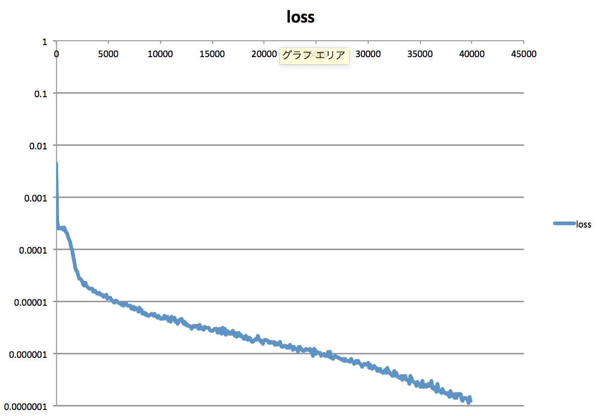
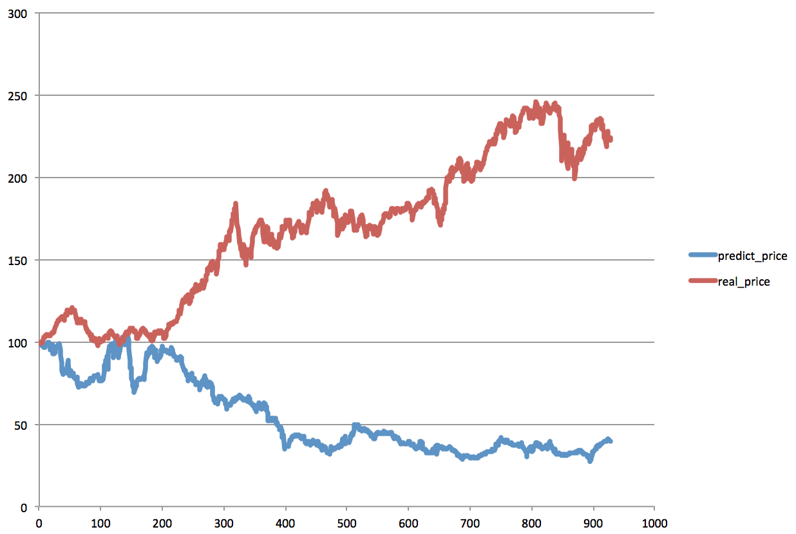
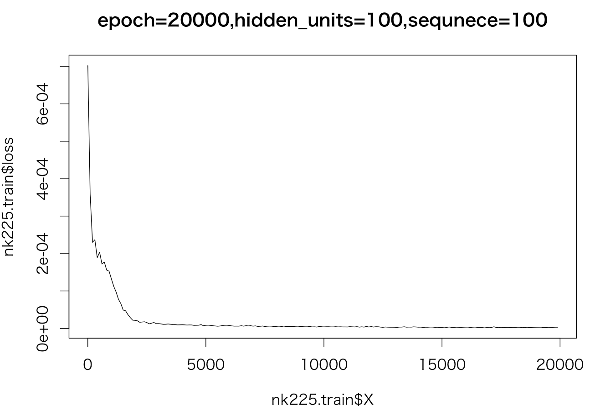
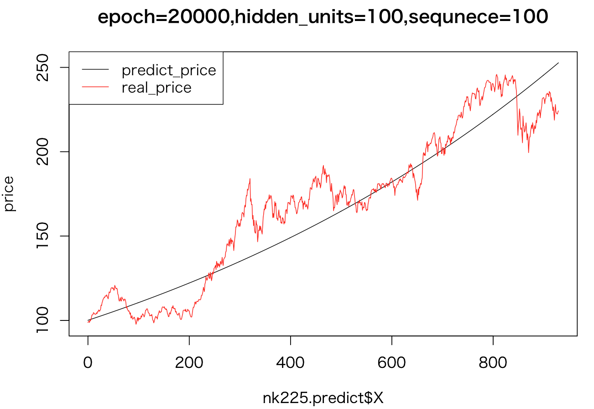

# 日経平均を予測する　その２

 そもそもやりたいこと       
 定量データ、定性データを使って翌月日経平均の騰落率を予想　ー＞　リターンが予測できれば色々使える　　　　　　　


[その１](LSTM.md)ではDeeplearningの可能性について確認。翌日日経平均リターンをDAX,DJ,OIL,GOLDなどの指数のリターンからLSTMを用いて予想。それなりに予想できているように見えるが、当日のリターンを毎回入力し予想しているので長期予想ではない。　　　　　　


１ヶ月先の日経平均を予想するには長期に積み重ねた予測が必要。入力値にすべてついて予測対象とする.
予測値をもとに予測を積み重ねる
-----

## 検証１
DAX,DJ,NK,OIL,GOLD,BOND,EURJPY,USDJPYを入力として日経平均予想       
隠れ層４層    
epochs 20000    
length of sequence 100    
hidden units 100    
#### 結果
```
python 36_nk225.py
```
計算収束状況


#### 予測



----


## 検証２
DAX,DJ,NKを入力として日経平均予想       
隠れ層４層    
epochs 20000    
length of sequence 100    
hidden units 100    
#### パラメタ
パラメタを選定する
```
R 36_nk225.R
```
dj,dax,nk225にする
#### 結果
```
python 37_nk225.py
```

#### 予測


----

## 検証３
NK,DAX,DJの順に並べた時系列データを１つ作成し予測
隠れ層２層    
epochs 20000    
length of sequence 100    
hidden units 100    
#### 結果
```
python 38_nk225.py
```
