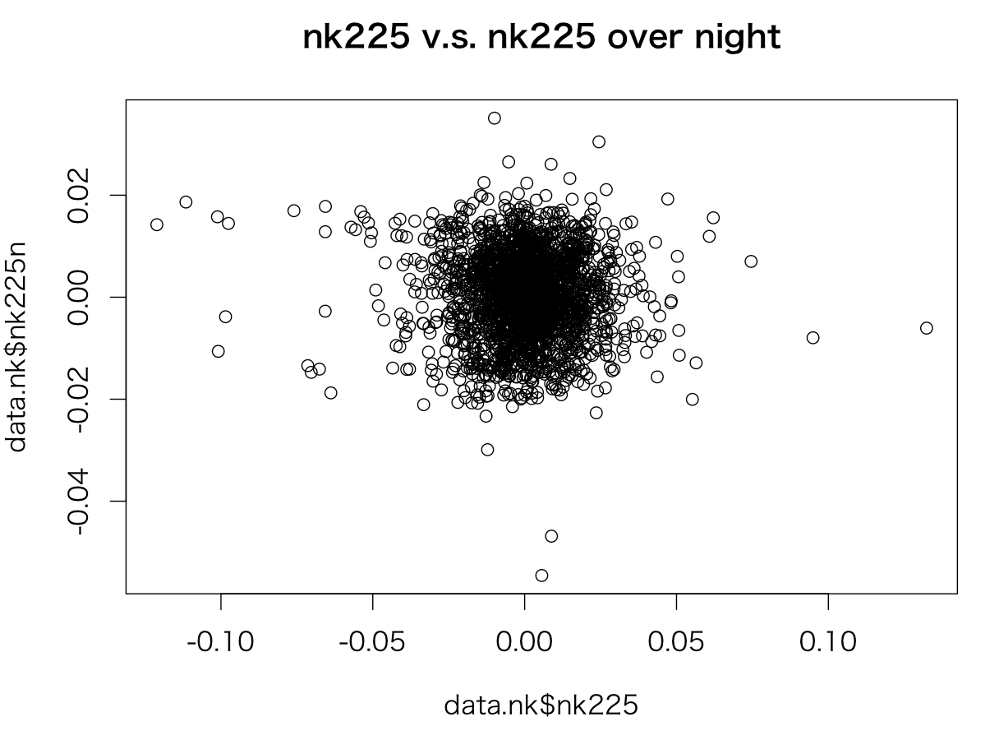
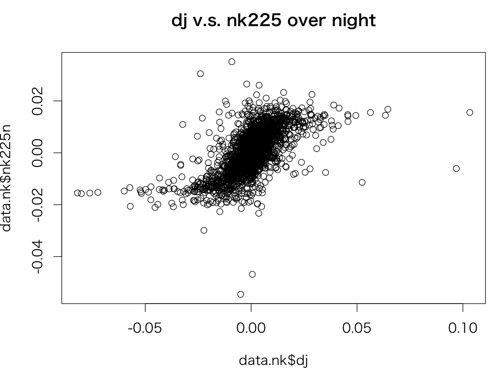
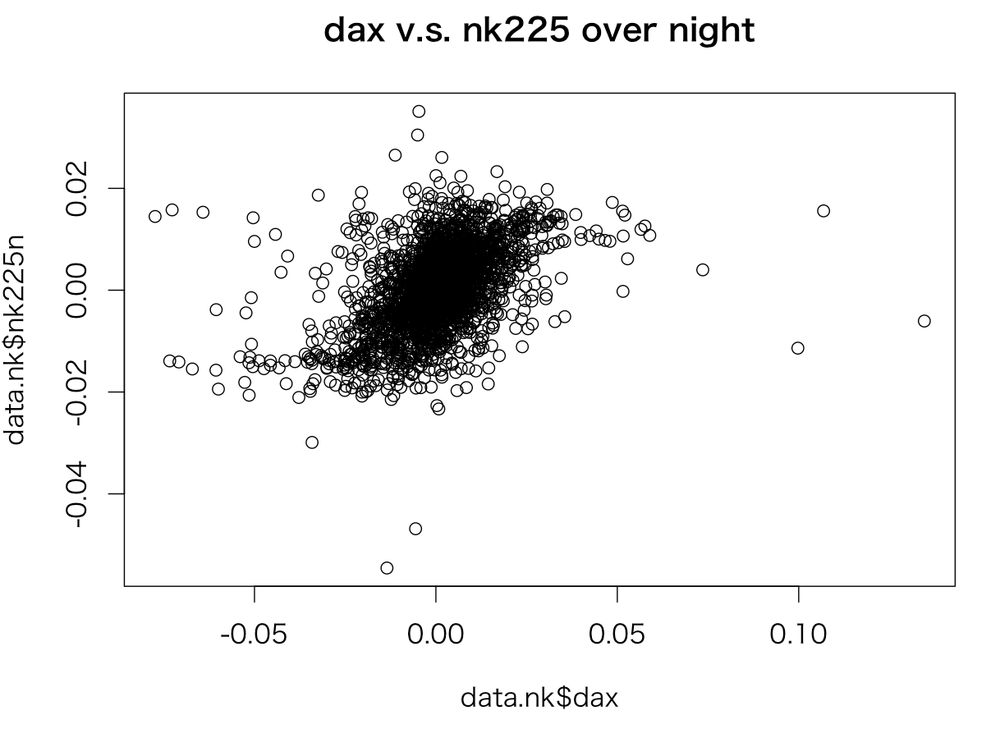
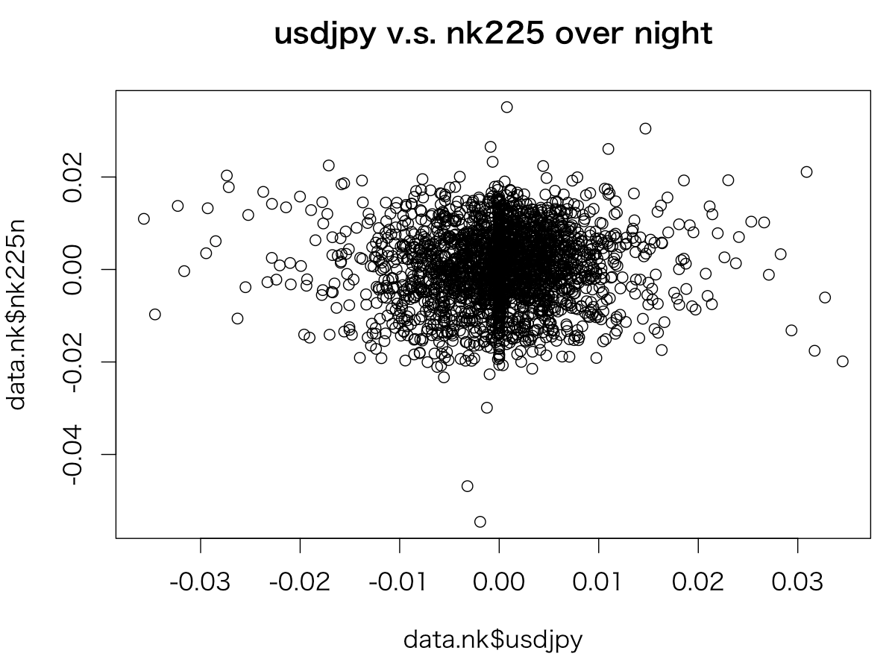
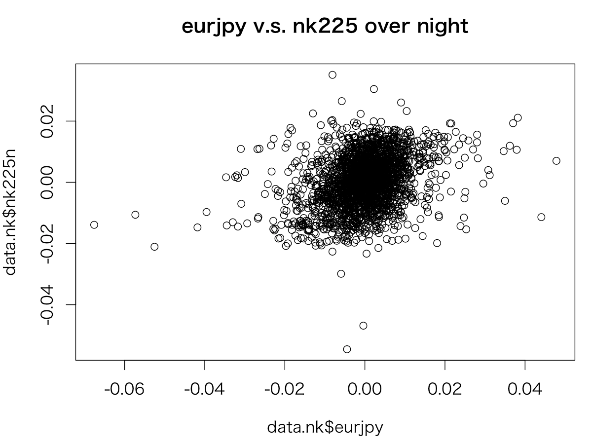
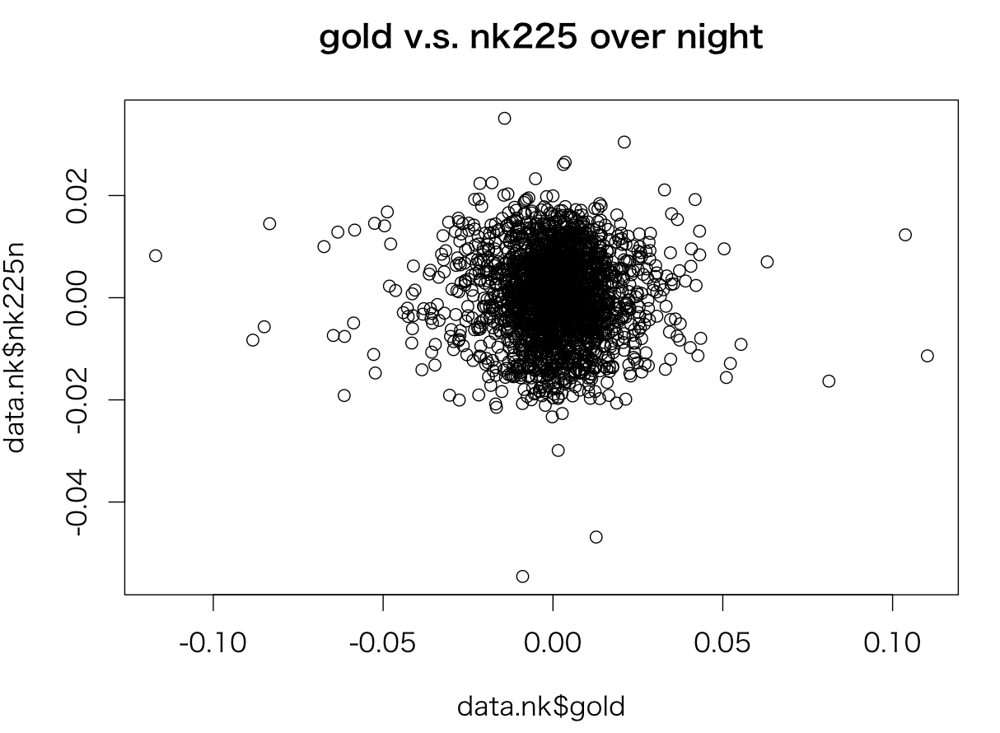
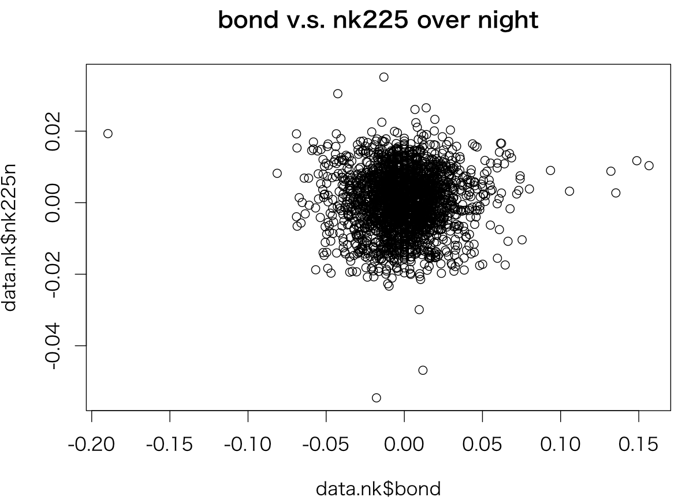
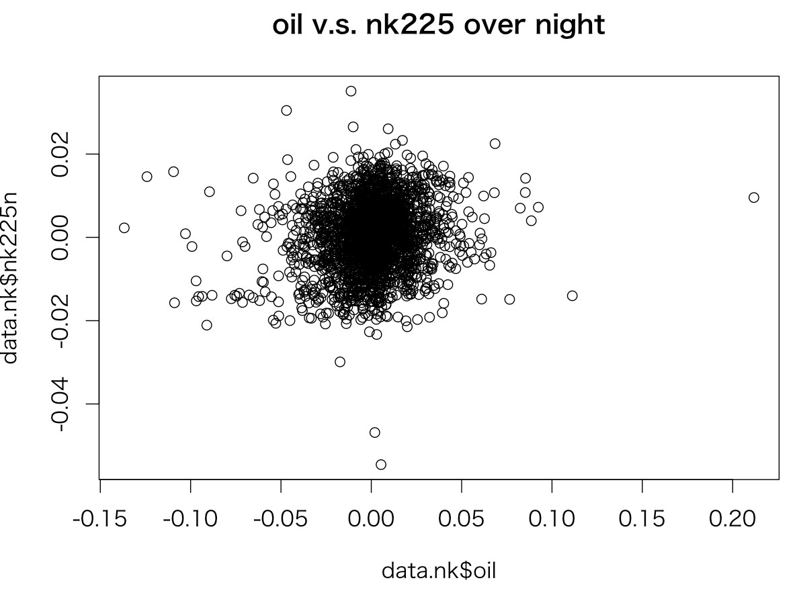

# 翌日日経平均の始値を予想

20161011記載　　　　

翌日の日経平均の始値を予測する。DJなどの騰落率を用いて、前日日経平均終値からの当日始値の騰落率を予測

## 方法
DAX,DJなど相関の高いパラメタを用いて線形モデルなどで予測。正答率を測定


20050101から20150101までの組み合わせでLMを実行しAICを見る


#### 結果　　　　
```
R 52_nk225.R
```
- 全５５組み合わせ中AICのパラメタへの採用数

|項目|採用数|
|:---|---:|
|nk225|54|
|dj|49|
|dax|50|
|usdjpy|36|
|eurjpy|53|
|oil|37|
|gold|26|
|bond|10|

- 計算期間１年

|項目|採用数|
|:---|---:|
|nk225|9|
|dj|10|
|dax|6|
|usdjpy|5|
|eurjpy|9|
|oil|3|
|gold|3|
|bond|3|

- 計算期間２年

|項目|採用数|
|:---|---:|
|nk225|10|
|dj|10|
|dax|8|
|usdjpy|6|
|eurjpy|8|
|oil|3|
|gold|4|
|bond|3|

#### データの詳細

2005/1/1 - 2015/1/1 までの全て












#### 検証1
計算期間１年、翌１年を予測、パラメタはdj,dax

|パラメタ計算期間|検証期間|騰落の正解率|
|:---|:---|---:|
|2005/1/1 - 2006/1/1|2006/1/1 - 2007/1/1|0.634042553191489|
|2006/1/1 - 2007/1/1|2007/1/1 - 2008/1/1|0.645021645021645|
|2007/1/1 - 2008/1/1|2008/1/1 - 2009/1/1|0.461206896551724|
|2008/1/1 - 2009/1/1|2009/1/1 - 2010/1/1|0.593073593073593|
|2009/1/1 - 2010/1/1|2010/1/1 - 2011/1/1|0.515021459227468|
|2010/1/1 - 2011/1/1|2011/1/1 - 2012/1/1|0.639484978540773|
|2011/1/1 - 2012/1/1|2012/1/1 - 2013/1/1|0.556034482758621|
|2012/1/1 - 2013/1/1|2013/1/1 - 2014/1/1|0.508695652173913|
|2013/1/1 - 2014/1/1|2014/1/1 - 2015/1/1|0.565789473684211|
|2014/1/1 - 2015/1/1|2015/1/1 - 2016/1/1|0.665217391304348|


#### 検証２
計算期間を予測日から過去１年、パラメタはdj,dax
```
> sum(data.df$updn)/length(data.df$updn)  # 正解率
[1] 0.7504735
```

#### Webサービス
[デモ](http://a003.kabumap.tokyo/shiny/nk225/)

#### まとめ
正解率は結構高い
