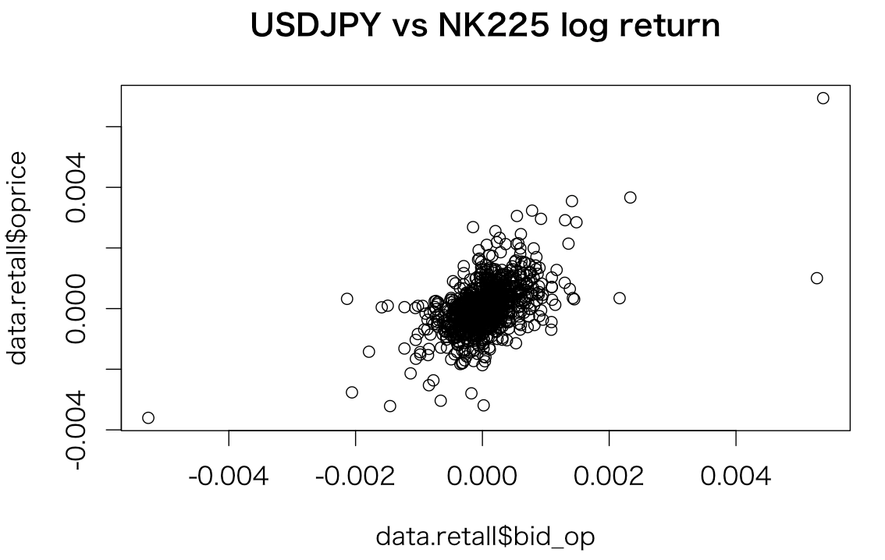
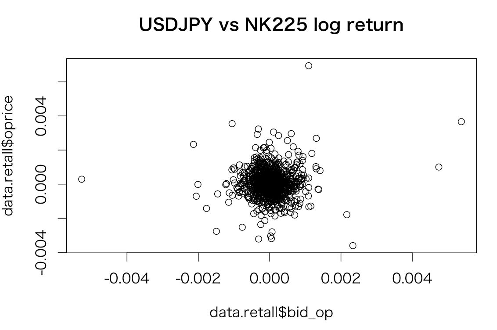

# 日経平均予測
リアルタイムに日経平均を予測、修正。USDJPYとの関連を見る


#### 条件
期間：2016/9/20 - 2016/10/14    

#### 時系列データ確認
```
> adf.test(data.all$oprice)

	Augmented Dickey-Fuller Test

data:  data.all$oprice
Dickey-Fuller = -2.8856, Lag order = 10, p-value = 0.2034
alternative hypothesis: stationary

> adf.test(data.all$bid_op)

	Augmented Dickey-Fuller Test

data:  data.all$bid_op
Dickey-Fuller = -2.4427, Lag order = 10, p-value = 0.3909
alternative hypothesis: stationary
```
日経平均、USDJPYともに非定常過程なので差分を取って確認する


#### 差分
```
> adf.test(data.retall$oprice)

	Augmented Dickey-Fuller Test

data:  data.retall$oprice
Dickey-Fuller = -8.5578, Lag order = 9, p-value = 0.01
alternative hypothesis: stationary

 警告メッセージ:
 adf.test(data.retall$oprice) で:  p-value smaller than printed p-value
> adf.test(data.retall$bid_op)

	Augmented Dickey-Fuller Test

data:  data.retall$bid_op
Dickey-Fuller = -9.2579, Lag order = 9, p-value = 0.01
alternative hypothesis: stationary

 警告メッセージ:
 adf.test(data.retall$bid_op) で:  p-value smaller than printed p-value
 ```
 ログリターンを取って検定をかけた。定常過程になったのでこれで予測する

#### 計算１
USDJPYと日経平均のリターンをそのまま相関係数を取る
```
R 54_cor.R
```
```
> data.res<-lm(oprice ~ bid_op,data.retall)
> summary(data.res)

Call:
lm(formula = oprice ~ bid_op, data = data.retall)

Residuals:
       Min         1Q     Median         3Q        Max
-0.0035421 -0.0003650  0.0000020  0.0003393  0.0027998

Coefficients:
             Estimate Std. Error t value Pr(>|t|)    
(Intercept) 1.473e-05  2.145e-05   0.687    0.492    
bid_op      8.587e-01  4.149e-02  20.695   <2e-16 ***
---
Signif. codes:  0 ‘***’ 0.001 ‘**’ 0.01 ‘*’ 0.05 ‘.’ 0.1 ‘ ’ 1

Residual standard error: 0.000674 on 989 degrees of freedom
Multiple R-squared:  0.3022,	Adjusted R-squared:  0.3015
F-statistic: 428.3 on 1 and 989 DF,  p-value: < 2.2e-16

```


#### 計算２
USDJPYを先行指標として５分ずらした後に相関を取る
```
R 54_cor.R
```
```
> data.res<-lm(oprice ~ bid_op,data.retall)
> summary(data.res)

Call:
lm(formula = oprice ~ bid_op, data = data.retall)

Residuals:
       Min         1Q     Median         3Q        Max
-0.0036968 -0.0004092 -0.0000133  0.0003263  0.0067901

Coefficients:
             Estimate Std. Error t value Pr(>|t|)
(Intercept) 3.967e-05  2.567e-05   1.545    0.123
bid_op      4.796e-02  5.084e-02   0.943    0.346

Residual standard error: 0.0008065 on 989 degrees of freedom
Multiple R-squared:  0.0008988,	Adjusted R-squared:  -0.0001114
F-statistic: 0.8897 on 1 and 989 DF,  p-value: 0.3458

```

無相間になった

#### 計算３
```
R 54_cor.R
```
```
> data.res<-lm(oprice ~ bid_op,data.retall)
> summary(data.res)

Call:
lm(formula = oprice ~ bid_op, data = data.retall)

Residuals:
       Min         1Q     Median         3Q        Max
-0.0038420 -0.0004212 -0.0000135  0.0003356  0.0068094

Coefficients:
             Estimate Std. Error t value Pr(>|t|)  
(Intercept) 3.922e-05  2.562e-05   1.531   0.1262  
bid_op      8.496e-02  5.028e-02   1.690   0.0914 .
---
Signif. codes:  0 ‘***’ 0.001 ‘**’ 0.01 ‘*’ 0.05 ‘.’ 0.1 ‘ ’ 1

Residual standard error: 0.0008057 on 989 degrees of freedom
Multiple R-squared:  0.002878,	Adjusted R-squared:  0.00187
F-statistic: 2.855 on 1 and 989 DF,  p-value: 0.09142
```

こちらも無相間になった

## まとめ
USDJPYと日経平均の日中足の相関はリアルタイムで同期している。予測には使えなさそうだ
