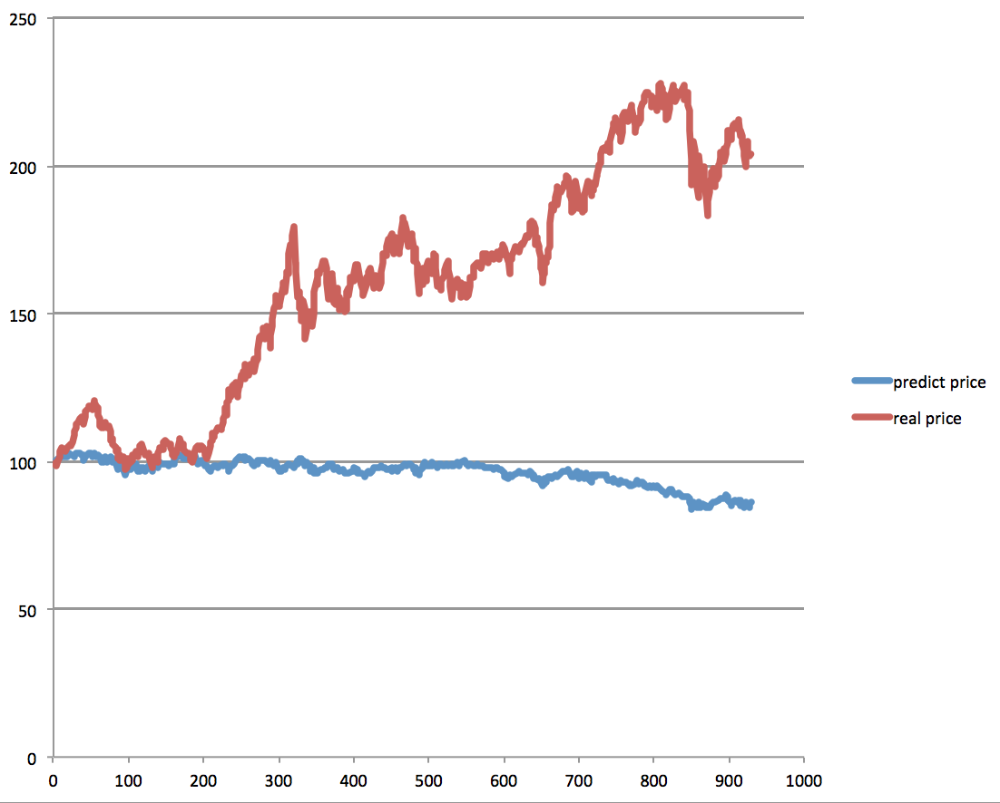
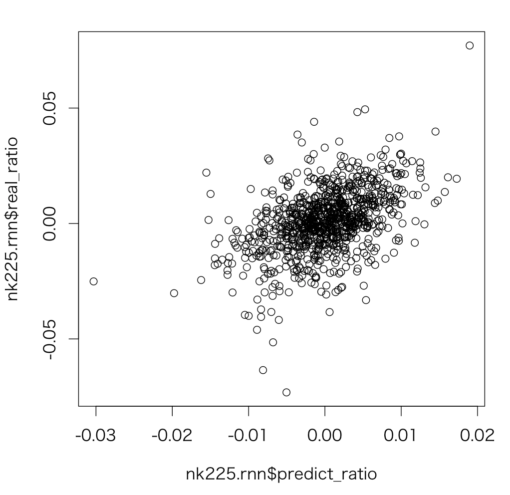
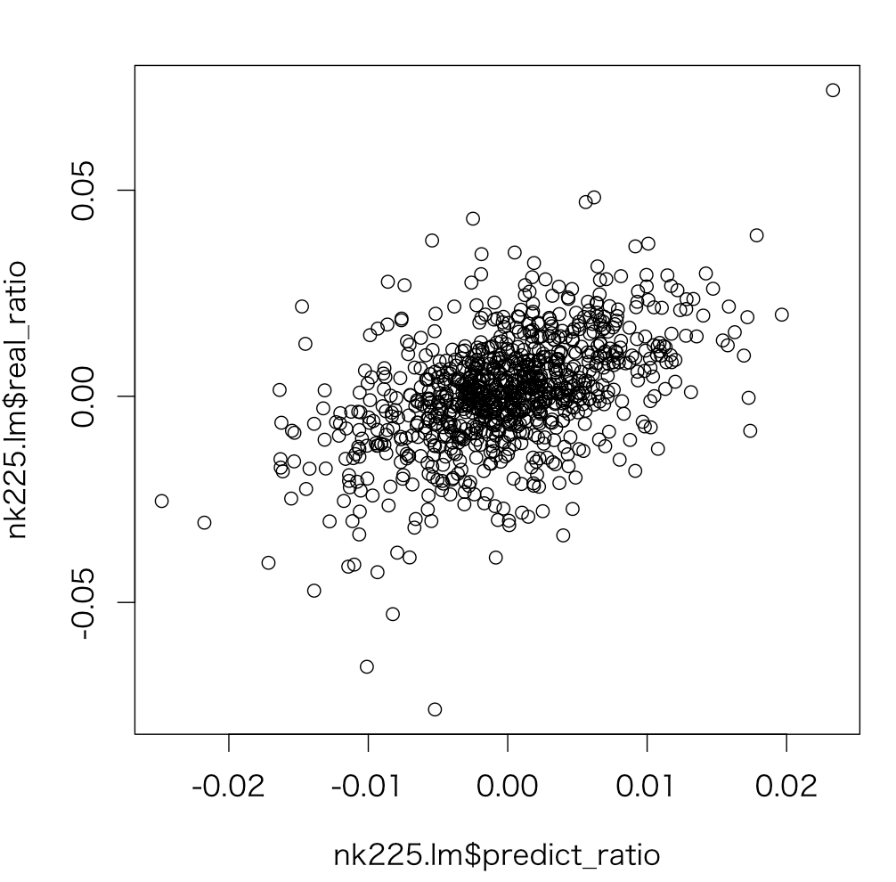

# 日経平均を予測する

## 進め方
[月例経済報告書](http://www5.cao.go.jp/keizai3/getsurei/kako_getsurei.html)と、定量データを組み合わせ、翌月の日経平均を予測する。     

まずは定量データを使って予想

----

## 月次データで推計
#### パラメタ選定
まず回帰分析でパラメタの選択。すべてlogリターンに直して相関を計算
```
R 32_nk225.R
```

```
> data.res<-lm(nk225n ~ nk225 + dj + dax + usdjpy + eurjpy + oil + bond + gold,data.lm)
> summary(data.res)

Call:
lm(formula = nk225n ~ nk225 + dj + dax + usdjpy + eurjpy + oil +
    bond + gold, data = data.lm)

Residuals:
      Min        1Q    Median        3Q       Max
-0.221125 -0.022050  0.004896  0.038552  0.112720

Coefficients:
             Estimate Std. Error t value Pr(>|t|)
(Intercept) -0.002145   0.008450  -0.254    0.800
nk225       -0.016629   0.226705  -0.073    0.942
dj          -0.115787   0.326085  -0.355    0.724
dax          0.252450   0.267349   0.944    0.349
usdjpy       0.363004   0.409269   0.887    0.378
eurjpy       0.069692   0.364836   0.191    0.849
oil          0.057393   0.112401   0.511    0.611
bond        -0.043084   0.119409  -0.361    0.719
gold        -0.169915   0.153853  -1.104    0.273

Residual standard error: 0.06615 on 65 degrees of freedom
Multiple R-squared:  0.08623,	Adjusted R-squared:  -0.02623
F-statistic: 0.7667 on 8 and 65 DF,  p-value: 0.633

```
月次データでは推測できそうになさそうだ


----


##日次データで推計
月次は使えないので日次で予測し積み重ねて１月分にする

#### パラメタ選定
まず回帰分析でパラメタの選択。すべてlogリターンに直して相関を計算
```
R 31_nk225.R
```
```
> data.res<-lm(nk225n ~ nk225 + dj + dax + usdjpy + eurjpy + oil + bond + gold,data.lm)
> summary(data.res)

Call:
lm(formula = nk225n ~ nk225 + dj + dax + usdjpy + eurjpy + oil +
    bond + gold, data = data.lm)

Residuals:
      Min        1Q    Median        3Q       Max
-0.123996 -0.006573  0.000241  0.007057  0.128535

Coefficients:
              Estimate Std. Error t value Pr(>|t|)    
(Intercept) -0.0003048  0.0003513  -0.868  0.38568    
nk225       -0.2652943  0.0268545  -9.879  < 2e-16 ***
dj           0.5404101  0.0346707  15.587  < 2e-16 ***
dax          0.1589123  0.0340810   4.663 3.37e-06 ***
usdjpy       0.0795568  0.0592917   1.342  0.17985    
eurjpy       0.1506388  0.0510363   2.952  0.00321 **
oil         -0.0062388  0.0158619  -0.393  0.69413    
bond         0.0118292  0.0194144   0.609  0.54241    
gold         0.0677134  0.0256670   2.638  0.00841 **
---
Signif. codes:  0 ‘***’ 0.001 ‘**’ 0.01 ‘*’ 0.05 ‘.’ 0.1 ‘ ’ 1

Residual standard error: 0.01422 on 1638 degrees of freedom
Multiple R-squared:  0.3089,	Adjusted R-squared:  0.3055
F-statistic:  91.5 on 8 and 1638 DF,  p-value: < 2.2e-16

```
前日日経平均、DJ、DAX,EURJPY,GOLDが相関あり?      
AICをかけてみる
```
> step(data.res)
Start:  AIC=-14001.25
nk225n ~ nk225 + dj + dax + usdjpy + eurjpy + oil + bond + gold

         Df Sum of Sq     RSS    AIC
- oil     1  0.000031 0.33115 -14003
- bond    1  0.000075 0.33119 -14003
- usdjpy  1  0.000364 0.33148 -14001
<none>                0.33112 -14001
- gold    1  0.001407 0.33253 -13996
- eurjpy  1  0.001761 0.33288 -13994
- dax     1  0.004395 0.33551 -13982
- nk225   1  0.019728 0.35085 -13908
- dj      1  0.049112 0.38023 -13776

Step:  AIC=-14003.09
nk225n ~ nk225 + dj + dax + usdjpy + eurjpy + bond + gold

         Df Sum of Sq     RSS    AIC
- bond    1  0.000079 0.33123 -14005
- usdjpy  1  0.000382 0.33153 -14003
<none>                0.33115 -14003
- gold    1  0.001379 0.33253 -13998
- eurjpy  1  0.001734 0.33288 -13996
- dax     1  0.004364 0.33551 -13984
- nk225   1  0.020013 0.35116 -13908
- dj      1  0.049391 0.38054 -13776

Step:  AIC=-14004.7
nk225n ~ nk225 + dj + dax + usdjpy + eurjpy + gold

         Df Sum of Sq     RSS    AIC
<none>                0.33123 -14005
- usdjpy  1  0.000450 0.33168 -14004
- gold    1  0.001386 0.33261 -14000
- eurjpy  1  0.001691 0.33292 -13998
- dax     1  0.004417 0.33564 -13985
- nk225   1  0.020626 0.35185 -13907
- dj      1  0.049506 0.38073 -13777

Call:
lm(formula = nk225n ~ nk225 + dj + dax + usdjpy + eurjpy + gold,
    data = data.lm)

Coefficients:
(Intercept)        nk225           dj          dax       usdjpy       eurjpy         gold  
 -0.0003096   -0.2621430    0.5394757    0.1586218    0.0871300    0.1448687    0.0668855  
```

NK225、DJ,DAX、USDJPY,EURJPY,GOLDを説明変数とする


#### 予測
```
query<-paste("select i.cprice as nk225,d.cl as dj,x.cl as dax,u.price as usdjpy,e.price as eurjpy,o.price as oil ,b.price as bond,g.price as gold from indexHist i,idcStockDaily d,idcStockDaily x,otherHist u,otherHist e,otherHist o,otherHist b,otherHist g where i.date=x.date and  i.date=d.date and i.date=o.date and i.date=u.date and i.date=e.date and i.date=b.date and i.date=g.date and i.indexCode='101' and d.indexCode='I_DJI' and x.indexCode='DAX' and u.otherCode='FEXCH' and e.otherCode='EURO' and o.otherCode='OIL' and b.otherCode='LBOND' and g.otherCode='GOLD' and i.date>='2012-01-01' and i.date<='2015-12-31' order by i.date asc",sep="")
pred<-fetch(dbSendQuery(con,query),n=-1)
#  -0.0003096   -0.2621430    0.5394757    0.1586218    0.0871300    0.1448687    0.0668855  
pred.ret<-log(pred[-1,])-log(pred[1:length(pred$nk225)-1,])
pred.lm<-pred.ret[1:length(pred.ret$nk225)-1,]
pred.lm$nk225n<-pred.ret[-1,]$nk225 # tomorrow nk225
nk225.actual<-100
nk225.predict<-100

for(i in 1:length(pred.lm$nk225)){
  p<-data.prm$coefficients
  d<-pred.lm[i,]
  n<-p[1]+d$nk225*p[2]+d$dj*p[3]+d$dax*p[4]+d$usdjpy*p[5]+d$eurjpy*p[6]+d$gold*p[7]
  nk225.actual<-nk225.actual*(1+d$nk225n)
  nk225.predict<-nk225.predict*(1+n)
  print(paste(i,",",nk225.predict,",",nk225.actual,",",n,",",d$nk225n,sep=""))
}
```

集計結果
```
> mean(abs(nk225.rnn$predict_ratio))   # RNNによる日経平均リターン予測
[1] 0.004172447
> mean(abs(nk225.rnn$real_ratio))      # 実際の日経平均リターン予測
[1] 0.01028737
>
> mean(abs(nk225.lm$predict_ratio))    # lmによる日経平均リターン予測
[1] 0.004683641
> mean(abs(nk225.lm$real_ratio))       # 実際の日経平均リターン予測
[1] 0.01028362
```
倍くらい差がある。予測値は平均化されているので長期予測は不利?

#### 検証　
予測値と実測値のリターンの相関
```
> cor(nk225.rnn$predict_ratio,nk225.rnn$real_ratio)
[1] 0.4660325
> cor(nk225.lm$predict_ratio,nk225.lm$real_ratio)
[1] 0.4883296
```
###### RNN予測
リターンの予測値と実測値
　
###### lm予測
リターンの予測値と実測値
　
  
