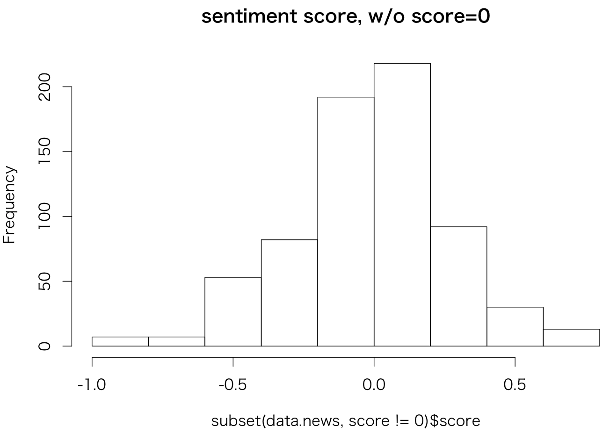
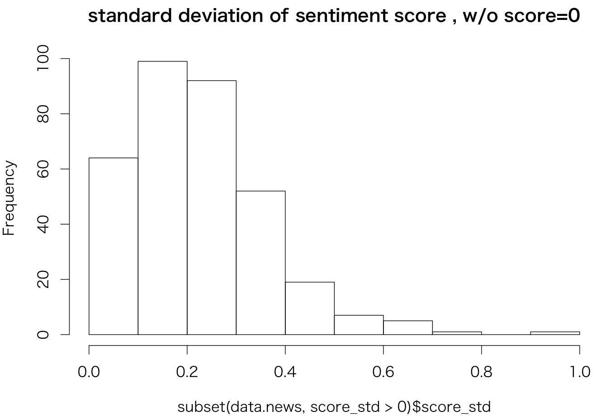
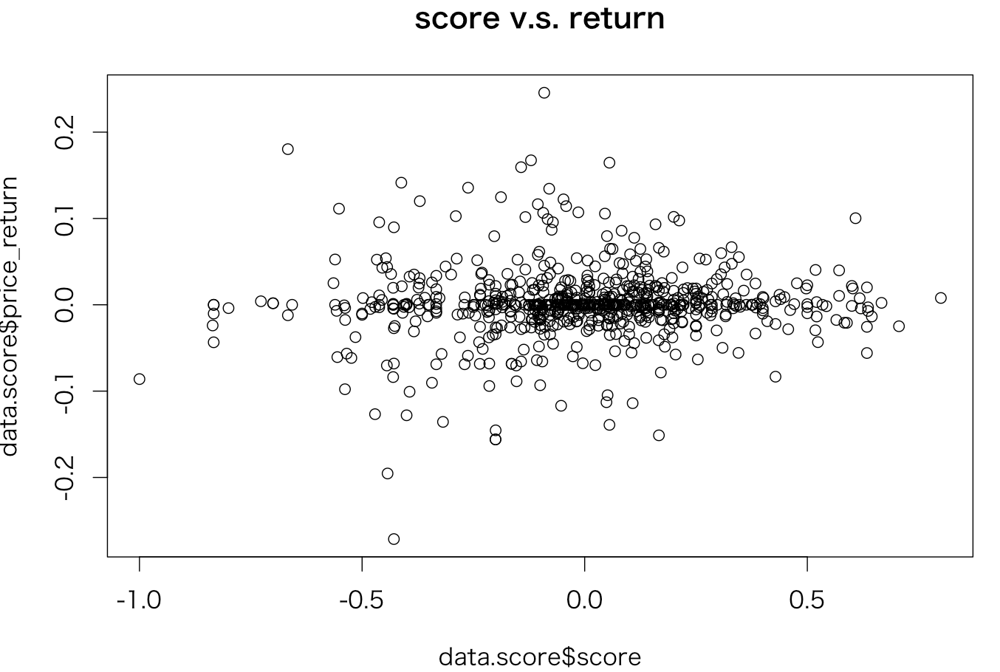

# センチメント検証 その１

センチメント指数を作成し検証する
### データソース
|データソース|期間|
|:---|:---|
|Yahooニュース|20160101-20160531|

<!---
|TDnet|20160101-2016531|
--->

---
### 手法
[DICT](DICT.md)で作成した辞書を用いてセンチメント指数作成  

###### ソース
[kensyo.rb](https://github.kabumap.tokyo/utsubo/sentiment/blob/master/senti/kensyo.rb)

###### 実行
```
$ kensyo.rb
```

1. 各文ごとに分割し、それぞれの文でcabochaによる係り受け抽出
1. 極性辞書に登録されている係り受けの場合には極性値を付与
1. 文書単位に極性値の平均をとる。また、その際の標準偏差を信頼度として出力
1. zaaa16d.qr.comのMySQLへ保存

---
### データストア　

###### yahooStockNews
ニュース記事一覧

| Field        | Type         | 内容 |
|:-------------|:-------------|:-----|
| date      | datetime     | ニュース配信時刻   |
| stockCode | varchar(8)   | 銘柄コード    |
| title     | varchar(255) | ニュースタイトル  |
| body      | text         | ニュース記事本文  |
| href      | varchar(255) | ニュース記事のURL,IDとして使用  |
| source    | varchar(32)  | ニュース配信元  |

###### yahooStockNewsSentiment

ニュース記事からセンチメント指数

| Field        | Type         | 内容 |
|:-------------|:-------------|:-----|
| href         | varchar(255) | ニュース記事のURL,IDとして使用   |
| date         | datetime     | ニュース配信時刻   |
| stockCode    | varchar(8)   | 銘柄コード   |
| score        | double       | センチメント指数  |
| score_cnt    | int(11)      | 文章内で係り受けの出現数  |
| score_std    | double       | 文章内でセンチメント指数の標準偏差  |
| price_return | double       | この記事が出現した後の価格騰落率  |
| price_score  | double       | 価格騰落率から求めたセンチメント指数  |

価格騰落率は[DICT](DICT.md)と同様に求めている

---
### 結果

###### ニュース記事数
```
mysql> select count(*) from yahooStockNews where date>="2016-01-01" and date< "2016-06-01";
+----------+
| count(*) |
+----------+
|     1644 |
+----------+
```
###### センチメント指数作成数
```
select count(*) from yahooStockNewsSentiment ;
+----------+
| count(*) |
+----------+
|     1033 |
+----------+
```

###### スコア
score=0を除く
```
> hist(subset(data.news,score!=0)$score,main="sentiment score, w/o score=0")
> summary(subset(data.news,score!=0)$score)
     Min.   1st Qu.    Median      Mean   3rd Qu.      Max.
-1.000000 -0.157300  0.005142 -0.006412  0.161400  0.800000
```


スコアは０近辺に集中

###### 信頼度
score=0を除く。

```
> hist(subset(data.news,score_std>0)$score_std,main="standard deviation of sentiment score , w/o score=0")
> summary(subset(data.news,score_std>0)$score_std)
    Min.  1st Qu.   Median     Mean  3rd Qu.     Max.
0.002612 0.123000 0.208600 0.225000 0.300500 0.942800
```

標準偏差は低めに集中


###### センチメントスコアと騰落率の関係
```
> # スコアとリターンの関
> data.score<-subset(data.news,score!=0)
> plot(data.score$score,data.score$price_return,main="score v.s. return")
> data.lm<-lm(price_return ~ score ,data=data.score)
> summary(data.lm)

Call:
lm(formula = price_return ~ score, data = data.score)

Residuals:
      Min        1Q    Median        3Q       Max
-0.268506 -0.012143 -0.001135  0.012147  0.245384

Coefficients:
            Estimate Std. Error t value Pr(>|t|)
(Intercept) 0.001075   0.001610   0.668    0.505
score       0.009186   0.005865   1.566    0.118

Residual standard error: 0.04247 on 694 degrees of freedom
Multiple R-squared:  0.003523,	Adjusted R-squared:  0.002087
F-statistic: 2.453 on 1 and 694 DF,  p-value: 0.1177
```
ほぼ無相関。。。。。    


----
### まとめ
景気ウオッチャー及びニュースと株価騰落率の関係から作成したのPositive、Negative極性辞書を用いて、ニュースのセンチメント指数を作成した。
その指数と株価騰落率の関係を調べたが優位な関係は見られなかった


---
### デモ

[でも画面](http://a003.kabumap.tokyo/news/)
