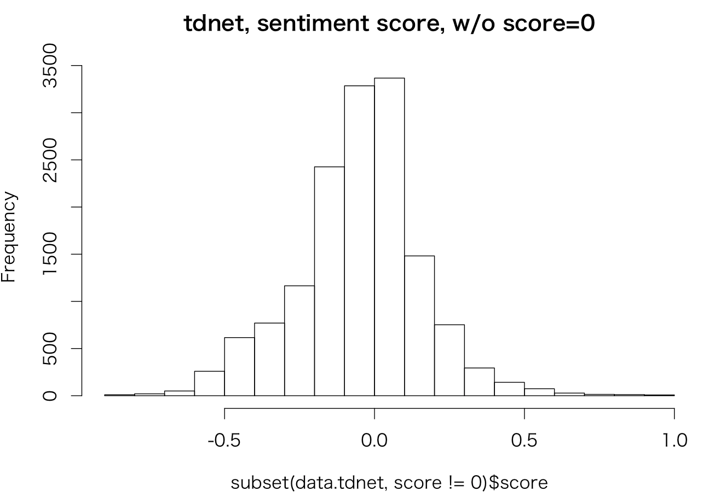
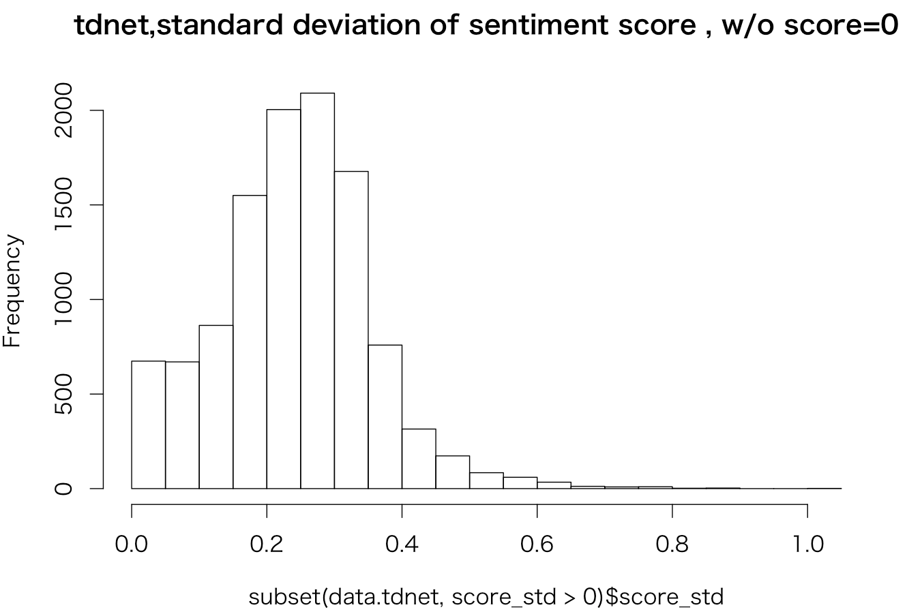
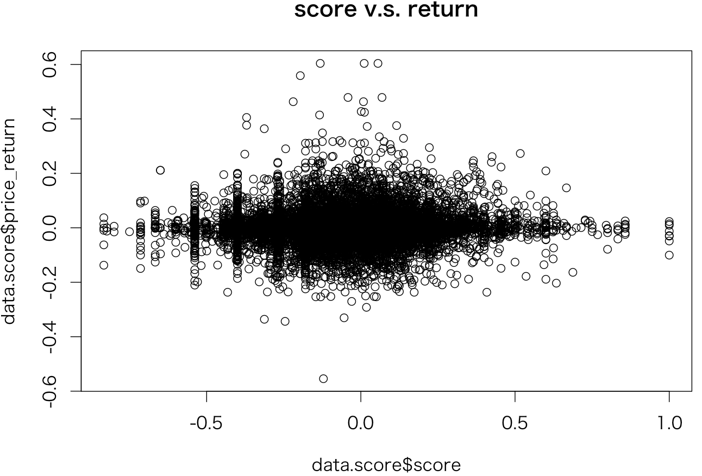

# センチメント検証 その２


### データソース
|データソース|期間|
|:---|:---|
|TDnet|20160101-2016531|


---
### 手法
[DICT](DICT.md)で作成した辞書を用いてセンチメント指数作成  

###### ソース
[kensyo_tdnet.rb](https://github.kabumap.tokyo/utsubo/sentiment/blob/master/senti/kensyo_tdnet.rb)

###### 実行
```
$ kensyo_tdnet.rb
```

1. 各文ごとに分割し、それぞれの文でcabochaによる係り受け抽出
1. 極性辞書に登録されている係り受けの場合には極性値を付与
1. 文書単位に極性値の平均をとる。また、その際の標準偏差を信頼度として出力
1. zaaa16d.qr.comのMySQLへ保存

---
### データストア　

###### tdnetSentiment

ニュース記事からセンチメント指数

| Field        | Type         | 内容 |
|:-------------|:-------------|:-----|
| id         | varchar(20) | IDとして使用,TDnetPDFのdisclosureNumber   |
| date         | datetime     | TDnet配信時刻   |
| stockCode    | varchar(8)   | 銘柄コード   |
| score        | double       | センチメント指数  |
| score_cnt    | int(11)      | 文章内で係り受けの出現数  |
| score_std    | double       | 文章内でセンチメント指数の標準偏差  |
| price_return | double       | この記事が出現した後の価格騰落率  |
| price_score  | double       | 価格騰落率から求めたセンチメント指数  |

価格騰落率は[DICT](DICT.md)と同様に求めている

---
### 結果

###### 記事数
```
mysql> select count(*) from live.TDnetPDF where disclosedDate>="2016-01-01" and disclosedDate< "2016-06-01";
+----------+
| count(*) |
+----------+
|    52429 |
+----------+
1 row in set (0.04 sec)
+----------+
```
###### センチメント指数作成数
```
mysql> select count(*) from tdnetSentiment where date>="2016-01-01" and date< "2016-06-01";
+----------+
| count(*) |
+----------+
|    15346 |
+----------+
1 row in set (0.01 sec)
```

###### スコア
score=0を除く
```
> hist(subset(data.tdnet,score!=0)$score,main="tdnet, sentiment score, w/o score=0")
> summary(subset(data.tdnet,score!=0)$score)
    Min.  1st Qu.   Median     Mean  3rd Qu.     Max.
-0.83330 -0.17480 -0.03770 -0.04889  0.07143  1.00000
```


スコアは０近辺に集中

###### 信頼度
score=0を除く。

```
> hist(subset(data.tdnet,score_std>0)$score_std,main="tdnet,standard deviation of sentiment score , w/o score=0")
> summary(subset(data.tdnet,score_std>0)$score_std)
   Min. 1st Qu.  Median    Mean 3rd Qu.    Max.
 0.0000  0.1686  0.2432  0.2395  0.3109  1.0200
```



###### センチメントスコアと騰落率の関係
```
> data.score<-subset(data.tdnet,score!=0)
> plot(data.score$score,data.score$price_return,main="score v.s. return")
> data.lm<-lm(price_return ~ score ,data=data.score)
> summary(data.lm)

Call:
lm(formula = price_return ~ score, data = data.score)

Residuals:
     Min       1Q   Median       3Q      Max
-0.55535 -0.02098 -0.00201  0.01837  0.60285

Coefficients:
             Estimate Std. Error t value Pr(>|t|)    
(Intercept) 0.0026181  0.0004873   5.372 7.90e-08 ***
score       0.0120398  0.0023015   5.231 1.71e-07 ***
---
Signif. codes:  0 ‘***’ 0.001 ‘**’ 0.01 ‘*’ 0.05 ‘.’ 0.1 ‘ ’ 1

Residual standard error: 0.05764 on 14772 degrees of freedom
Multiple R-squared:  0.001849,	Adjusted R-squared:  0.001782
F-statistic: 27.37 on 1 and 14772 DF,  p-value: 1.705e-07
```
ほぼ無相関。。。。。    


----
### まとめ


---
### デモ

[demo画面](http://a003.kabumap.tokyo/shiny/news/)
