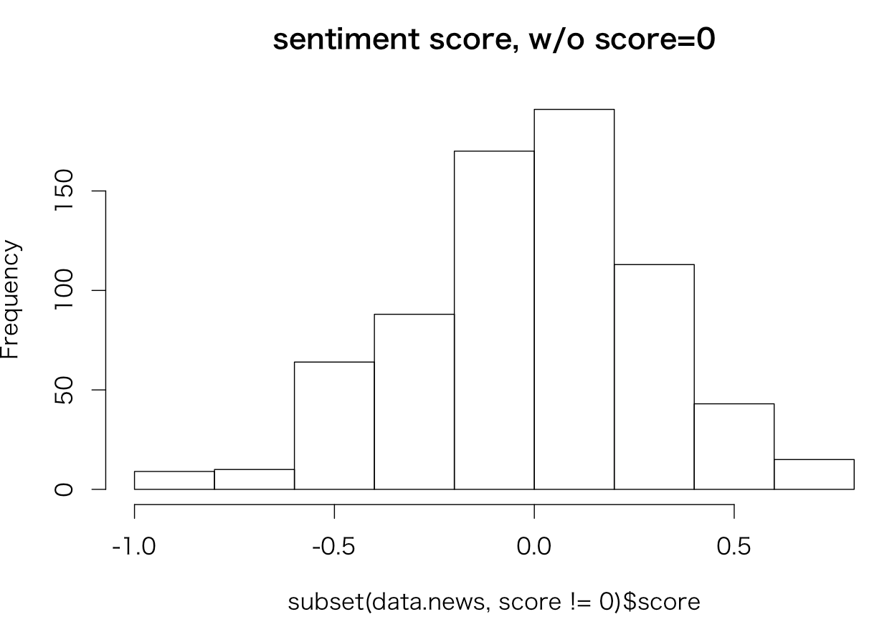
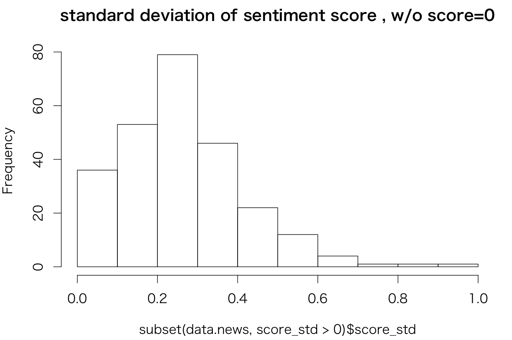
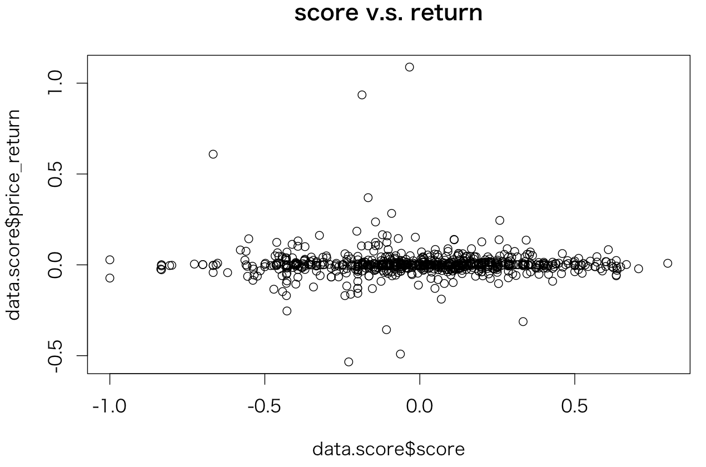

# センチメント検証その３

リターンを対TOPIXの60週ヒストリカルベータで調整


### データソース
|データソース|期間|
|:---|:---|
|Yahooニュース|20160101-20160531|

### 手法
[DICT2](DICT2.md)の辞書を使って[SENTI](SENTI.md)と同じ検証

###### 実行
```
$ kensyo2.rb
```

---
### データストア　

###### yahooStockNews
ニュース記事一覧

| Field        | Type         | 内容 |
|:-------------|:-------------|:-----|
| date      | datetime     | ニュース配信時刻   |
| stockCode | varchar(8)   | 銘柄コード    |
| title     | varchar(255) | ニュースタイトル  |
| body      | text         | ニュース記事本文  |
| href      | varchar(255) | ニュース記事のURL,IDとして使用  |
| source    | varchar(32)  | ニュース配信元  |

###### yahooStockNewsSentiment2

ニュース記事からセンチメント指数

| Field        | Type         | 内容 |
|:-------------|:-------------|:-----|
| href         | varchar(255) | ニュース記事のURL,IDとして使用   |
| date         | datetime     | ニュース配信時刻   |
| stockCode    | varchar(8)   | 銘柄コード   |
| score        | double       | センチメント指数  |
| score_cnt    | int(11)      | 文章内で係り受けの出現数  |
| score_std    | double       | 文章内でセンチメント指数の標準偏差  |
| price_return | double       | この記事が出現した後の価格騰落率  |
| price_score  | double       | 価格騰落率から求めたセンチメント指数  |

価格騰落率は[DICT](DICT.md)と同様に求めている

---
### 結果

###### ニュース記事数
```
mysql> select count(*) from yahooStockNews where date>="2016-01-01" and date< "2016-06-01";
+----------+
| count(*) |
+----------+
|     1644 |
+----------+
```
###### センチメント指数作成数
```
select count(*) from yahooStockNewsSentiment2 ;
+----------+
| count(*) |
+----------+
|     705  |
+----------+
```

###### スコア
score=0を除く
```
> par(mfrow=c(1,1))
> # スコア、０を除く
> hist(subset(data.news,score!=0)$score,main="sentiment score, w/o score=0")
> summary(subset(data.news,score!=0)$score)
     Min.   1st Qu.    Median      Mean   3rd Qu.      Max.
-1.000000 -0.185200  0.010310 -0.004286  0.200000  0.800000

```
若干平均が小さくなった


スコアは０近辺に集中

###### 信頼度
score=0を除く。

```
> # 0は信頼度を出せない
> hist(subset(data.news,score_std>0)$score_std,main="standard deviation of sentiment score , w/o score=0")
> summary(subset(data.news,score_std>0)$score_std)
    Min.  1st Qu.   Median     Mean  3rd Qu.     Max.
0.003422 0.155300 0.250800 0.265600 0.349700 0.942800
```

標準偏差は若干上がった


###### センチメントスコアと騰落率の関係
```
> ###
> # スコアとリターンの関
> data.score<-subset(data.news,score!=0)
> plot(data.score$score,data.score$price_return,main="score v.s. return")
> data.lm<-lm(price_return ~ score ,data=data.score)
> summary(data.lm)

Call:
lm(formula = price_return ~ score, data = data.score)

Residuals:
     Min       1Q   Median       3Q      Max
-0.53783 -0.01620 -0.00312  0.00978  1.08530

Coefficients:
             Estimate Std. Error t value Pr(>|t|)
(Intercept)  0.003122   0.003136   0.996    0.320
score       -0.002300   0.010371  -0.222    0.825

Residual standard error: 0.08314 on 701 degrees of freedom
Multiple R-squared:  7.018e-05,	Adjusted R-squared:  -0.001356
F-statistic: 0.0492 on 1 and 701 DF,  p-value: 0.8245

```
無相関に変わりなし


----
### まとめ
景気ウオッチャー及びニュースと株価騰落率の関係から作成したのPositive、Negative極性辞書を用いて、ニュースのセンチメント指数を作成した。
ベータによる調整を入れたが、その指数と株価騰落率の関係を調べたが優位な関係は見られなかった
